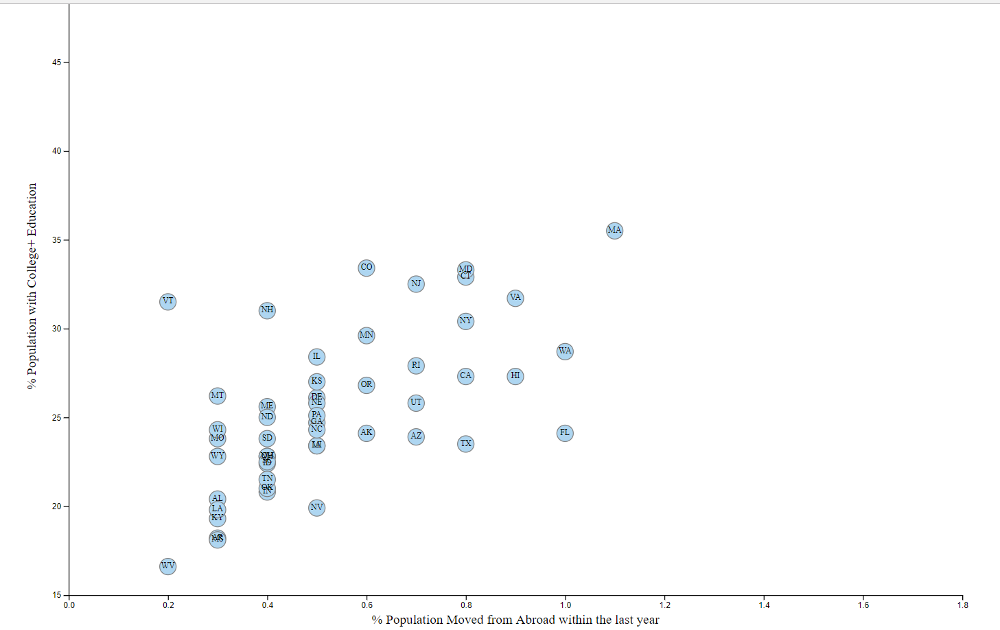

# US College Educated Population vs Geographic Mobility from Abroad

This project shows the correlation between the College Educated Population and the Geographic Mobility from Abroad. It seems that states with a higher population of college educated individuals also see more mobility from people coming from abroad to their state.

d3 was used for the graphing of this chart.

Data on the percentage of population with College+ Education was taken from the [Behavioral Risk Factor Surveillance System](https://chronicdata.cdc.gov/Behavioral-Risk-Factors/BRFSS-2014-Overall/5ra3-ixqq).

Data on the percentage of the population who moved from abroad within the last year was taken from the US Census Bureau's [Fact Finder Tool](http://factfinder.census.gov/faces/nav/jsf/pages/searchresults.xhtml). Specifically, Dataset: 2014 ACS 1-year Estimate and Table: S0701 Geographic Mobility by Selected Characteristics in the United States

